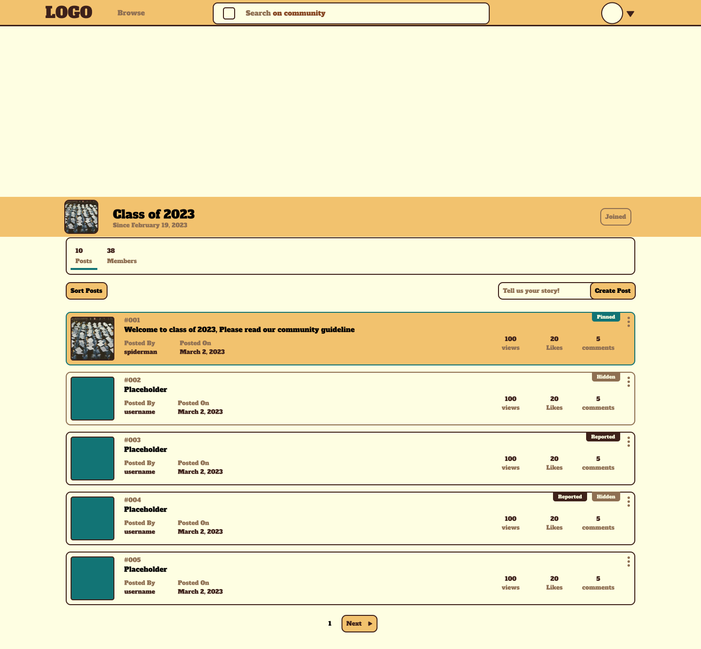

# TriFora

*Find, Connect, and Build!*

An academic social media platform that bridges the gap between students and educators through meaningful community engagement and collaboration.

## Key Features

- **Community Discovery**: Find and join community that match your interests
- **Content Sharing**: Share diverse content from academic materials to housing listings and event announcements
- **Customizable Community Spaces**: Personalize every aspect of your community page - from colors and layout to content organization

## Design & Development Process

This platform was developed following a comprehensive design process:

* Iterative development process with continuous user feedback from college students
* User-centered design approach focusing on diverse community needs
* Accessibility-first approach following WCAG guidelines

## Tech Stack

- **React**: Core frontend framework
- **Figma**: Low and high fidelity wireframes
- **Google Lighthouse**: Performance and accessibility monitoring

## Preview

